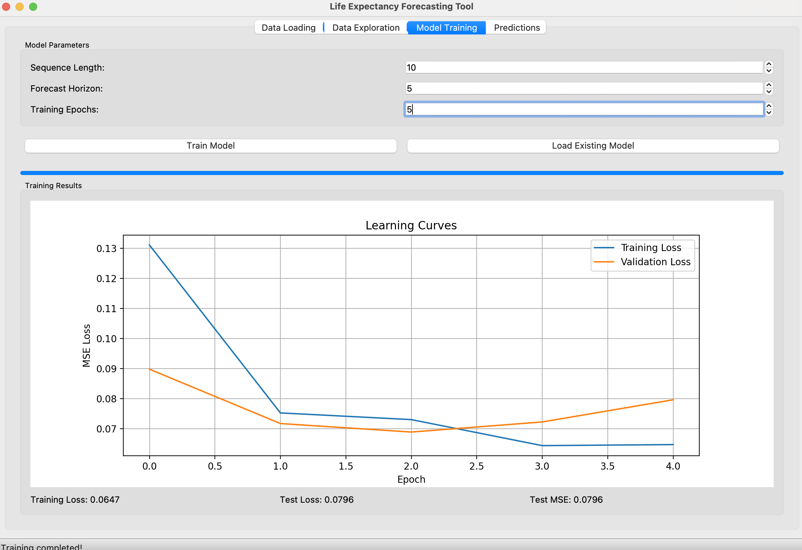

# LongevAI: Transformer-Based Forecasting for Global Life Expectancy

<p align="center">
  
</p>

<p align="center">
  <a href="#overview">Overview</a> •
  <a href="#features">Features</a> •
  <a href="#dataset">Dataset</a> •
  <a href="#installation">Installation</a> •
  <a href="#usage">Usage</a> •
  <a href="#screenshots">Screenshots</a> •
  <a href="#roadmap">Roadmap</a> •
  <a href="#license">License</a> •
  <a href="#acknowledgements">Acknowledgements</a>
</p>

## Overview

LongevAI is a powerful life expectancy forecasting tool that leverages transformer-based deep learning to predict future longevity trends across different countries and regions. The project uses historical data spanning from 1960 to 2022 and provides gender-specific predictions that can be visualized and exported through a user-friendly desktop interface.

The core of the project is a transformer encoder architecture specifically designed for time series forecasting, which captures complex temporal patterns in demographic data. This approach enables the model to account for regional variations and gender differences when making predictions.

## Features

### Data Analysis & Visualization
- **Historical Trend Analysis**: Visualize life expectancy trends from 1960-2022
- **Regional Comparisons**: Compare life expectancy across different geographical regions
- **Gender Gap Analysis**: Track the evolution of gender differences in longevity
- **Interactive Data Exploration**: Select specific countries and metrics to explore

### AI-Powered Forecasting
- **Transformer-Based Model**: Employs state-of-the-art sequence modeling architecture
- **Multi-Horizon Predictions**: Forecasts up to 10 years into the future
- **Gender-Specific Projections**: Separate predictions for women and men
- **Regional Context Awareness**: Incorporates geographical information for better predictions

### User-Friendly Interface
- **Desktop GUI Application**: Intuitive interface requiring no coding knowledge
- **4-Tab Design**: Organized workflow from data loading to prediction
- **Interactive Visualizations**: Dynamic charts for data exploration and forecasting
- **CSV Export**: Export predictions for further analysis or reporting

## Dataset

The project uses a comprehensive global life expectancy dataset covering 215 countries/entities from 1960 to 2022. The dataset includes:

- Country information (code, name, geographical regions)
- Year-by-year records
- Gender-specific life expectancy values for women and men
- Approximately 13,400 entries in total

**Attribution**: This dataset is derived from the World Bank's World Development Indicators and the United Nations Population Division's World Population Prospects. The compiled version used in this project was assembled for research and educational purposes.

## Installation

### Prerequisites
- Python 3.8 or higher
- pip package manager

### Setup

1. Clone the repository:
```bash
git clone https://github.com/DPSDevops/LongevAI-Transformer-Based-Forecasting-for-Global-Life-Expectancy.git
cd LongevAI-Transformer-Based-Forecasting-for-Global-Life-Expectancy
```

2. Install the required dependencies:
```bash
pip install -r requirements.txt
```

## Usage

### Command Line Interface

For script-based analysis and model training:

```bash
python life_expectancy_analysis.py
```

This will:
1. Load and analyze the dataset
2. Generate visualizations of life expectancy trends
3. Train the transformer model
4. Generate future predictions for selected countries

### Desktop GUI Application

For a user-friendly interface:

```bash
python life_expectancy_gui.py
```

The GUI application offers the following functionality across four tabs:

1. **Data Loading**
   - Load CSV files with custom separator and decimal options
   - Preview the loaded data in a table view

2. **Data Exploration**
   - Generate various visualizations for the loaded data
   - Select countries for trend analysis
   - Analyze regional differences and gender gaps

3. **Model Training**
   - Configure model parameters (sequence length, forecast horizon, epochs)
   - Track training progress with a progress bar
   - View training metrics and learning curves
   - Load existing pre-trained models

4. **Predictions**
   - Select countries for prediction
   - Set number of years to forecast
   - View predictions in both tabular and chart formats
   - Export predictions to CSV files

## Screenshots

<p align="center">
  
  
</p>
<p align="center">
  
  
</p>

## Model Architecture

The forecasting model uses a transformer encoder architecture:

1. **Input Processing**: Historical life expectancy data is processed along with geographical features
2. **Embedding Layer**: Projects input features into a latent space
3. **Transformer Encoder**: Multi-head self-attention layers capture temporal dependencies
4. **Output Layer**: Generates predictions for the specified forecast horizon

The model is trained using mean squared error (MSE) loss and the Adam optimizer, achieving strong predictive performance, especially for countries with stable demographic trends.

## Prediction Methodology

The model predicts future life expectancy by:
1. Using the most recent 10 years of data for a given country
2. Applying the transformer model to capture temporal patterns
3. Forecasting life expectancy values for both women and men for the next 5 years (default) or more
4. Leveraging regional and sub-regional information through one-hot encoding

## Sample Results

Example predictions for the United States (2023-2027):

| Year | Women | Men  |
|------|-------|------|
| 2023 | 80.68 | 75.42|
| 2024 | 80.27 | 75.04|
| 2025 | 80.52 | 75.25|
| 2026 | 80.65 | 75.47|
| 2027 | 80.90 | 75.56|

## Roadmap

Future development plans include:

- **Additional Demographic Factors**: Incorporate economic, healthcare, and social indicators
- **Uncertainty Quantification**: Add confidence intervals to predictions
- **Web Application**: Develop a web-based version for broader accessibility
- **Multi-Demographic Forecasting**: Extend to other demographic indicators like fertility and mortality
- **Integration with External Data Sources**: API connections to live demographic data sources
- **Improved Visualizations**: Enhanced charts and geographic heat maps

## License

This project is licensed under the MIT License - see the [LICENSE](LICENSE) file for details.

## Acknowledgements

- World Bank and United Nations Population Division for the underlying demographic data
- PyTorch team for the deep learning framework
- NumPy, Pandas, and Matplotlib developers for data science tools
- Python community for continued support and innovation

## Author

Developed by Tolstoy Justin ([GitHub](https://github.com/DPSDevops), [Email](mailto:tolstoyjustin@gmail.com))

If you use this project for academic research or publications, please cite:

```
Justin, T. (2023). LongevAI: Transformer-Based Forecasting for Global Life Expectancy. 
GitHub: https://github.com/DPSDevops/LongevAI-Transformer-Based-Forecasting-for-Global-Life-Expectancy
```

---

<p align="center">
  <i>LongevAI - Understanding our future through data-driven demographic forecasting</i>
</p> 